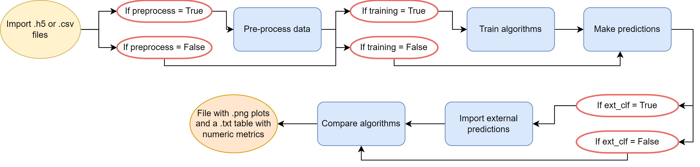
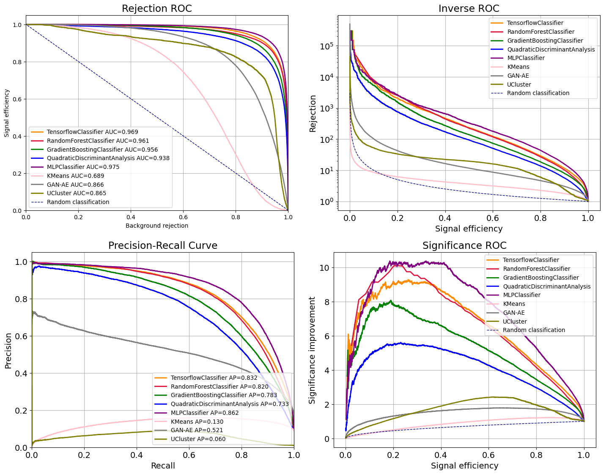

<h1 align="center"> :sparkles: benchtools :sparkles: </h1>

> Repository of the tools developed for the [final degree project](https://github.com/marianaiv/tesis_grado_UCV) of Mariana Vivas.   

[](https://www.gnu.org/licenses/gpl-3.0)

# **Table of Contents:**

- [About the project](#about_project)
- [About the repository](#about_repo)
- [The `benchtools` package](#benchtools)
- [Development and testing](#testing)
- [License](#license)

# About the project <a name="about_project"></a>

The tools developed in the `benchtools` package are for a project that aims to study **machine learning techniques for the search of new physics in dijets events by the development of tools to assert the performance of different approximations**. These approximations include algorithms from package like sklearn and simple tensorflow models, to more complex algorithms like [UCluster](https://github.com/ViniciusMikuni/UCluster) and [GAN-AE](https://github.com/lovaslin/GAN-AE_LHCOlympics), which participated in the [LHC Olympics 2020](lhco2020.github.io/homepage/). 

The project itself is in Spanish and more information about it and the results obtained can be found in this [link](https://github.com/marianaiv/tesis_grado_UCV).

# About the repository <a name="about_repo"></a>

**The tools developed to compare the performance of the algorithms are in this repository**. 

Some of the tools that can be found here are for:
- The use and transformation of data as the one used in the LHC Olympics 2020.
- Clustering of jets.
- Calculation of physical variables related to jets.
- Functions for plots separating signal and background.
- Calculation of performace metrics for the algorithms.
- Functions for plots to compare the performance of the algorithms.

## Content of the repository <a name="content"></a>
The content of this repository is organized as follows:
* :computer: [benchtools](benchtools): Package with the tools described above, scripts to transform data and a pipeline to compare binary classification algorithms.
* :bar_chart: [data](data): Data to use with the pipeline, in the notebooks, and in the tests.
* :camera: [figures](figures): Figures for this ReadMe file.
* :books: [notebooks](notebooks): Jupyter Notebooks with data exploration and analysis, use of different ML algorithms and anything related to the development of the benchtools package. In these notebooks are examples of how the functions of the package can be used.
* :wrench: [tests](tests): Code for testing the functions and the pipeline in the benchtools package.

More information about the content of each file can be found on the README file on each folder.

# The `benchtools` package <a name="benchtools"></a>
> A Python package for benchmarking binary classification algorithms 
## Workflow
`benchtools` works with input data of dijet events as the one published for the [LHC Olympics 2020](lhco2020.github.io/homepage/):
> [The data has] the following event selection: at least one anti-kT R = 1.0 jet with pseudorapidity |η| < 2.5 and transverse momentum pT > 1.2 TeV.   For each event, we provide a list of all hadrons (pT, η, φ, pT, η, φ, …) zero-padded up to 700 hadrons.

As the idea is to use it to compare models, some simple models are trained and used to get predictions in the pipeline. However, a .txt can be passed to the pipeline with a list of files that contains a classifier object with the true labes, scores, and predictions given by any external classifier. 

`benchtools` process the data, train some models and compares them with externaly inserted ones using performance metrics. The pipeline follows these steps (figure below):
- **Input**: .h5 file with raw data (or .csv with pre-processed data) and .txt with a list of files, each with a classifier object.
- **Steps**
1. Pre-process the data by clustering the jets and calculating pT, m, η, φ, E, 𝜏12, n_hadrons for the two principal jets and mjj, ΔR12, and n_hadrons for the event.
2. Scale the data and train the following classifiers: random forest, gradiend boosting, quadratic discriminant analysis, multilayer perceptron, K-Means and a sequential tensorflow model. 
3. Save the trained models.
4. Get predictions and scores from each classifier.
5. Loads the list of classifier objects from the .txt file.
6. Compares the algorithms:
    - Calculating balanced accuracy, precision, F1 score, recall, log loss and plotting this in bar plots to compare the classifiers.
    - Plotting: signal efficiency vs. background rejection, inverse ROC, significance improvement, precision-recall
- **Output**: Folder with .png for all the plots and a .txt of a table with the calculated variables.

Here is a flowchart of the process described above,



## Installation
The `benchtools` package requires Python 3.7 or greater. First, clone the repository.
```
git clone https://github.com/marianaiv/GAN-AE_LHCOlympics.git
```
Enter the repository.
```
cd GAN-AE_LHCOlympics
```
Then, create a virtual enviroment from the eviroment file using conda and activate it.
```
conda env create -f environment.yml
conda activate benchtools
```
Install `benchtools`.
```
pip install . --use-feature=in-tree-build
```
## Running `benchtools`
The pipeline can be run from the command line. The options for running it are:
```
benchtools_run --help
```
Output:
```
usage: benchtools_run [-h] [--dir DIR] [--out OUT] [--name NAME] [--models MODELS] [--ext_clf EXT_CLF] [--box BOX] [--RD] [--file FILE] [--nevents NEVENTS] [--nbatch NBATCH]
                      [--all_data] [--training]

Run benchtools benchmarking pipeline

optional arguments:
  -h, --help         show this help message and exit
  --dir DIR          Folder containing the input files [Default: ../../data]
  --out OUT          Folder to save output files [Default: ../../logs]
  --name NAME        Name of the output folder. The folder is created in --out [Default: log]
  --models MODELS    Name to save the models and models to use [Default: log]
  --ext_clf EXT_CLF  Path for the .txt with the list of external classifiers to compare. The files in the list have to be in --dir if added [Default: None]
  --box BOX          Black Box number, ignored if RD dataset [default: 1]
  --RD               Use RD data set [default: False]
  --file FILE        Path to pre-processed file to use in training and classification
  --nevents NEVENTS  Number of events to use. If all_data is True, then this flag has no effect [default: 100,000]
  --nbatch NBATCH    Number batches [default: 10]
  --all_data         Use the complete dataset [default: False]
  --training         To train the algorithms. If the models have not been trained before, is needed for the script to run [default: False]
```
## Data
To run the pipeline is necessary to download the files and save them in the *data* file of the repository. The data can be found in zenodo:
- [R&D dataset](https://zenodo.org/record/2629073#.XjOiE2PQhEa)
- [Black Boxes and labels](https://zenodo.org/record/4536624)
## Output for `benchtools`
The output are .png files comparing the models with numeric and bidimensional metris for binary classification, and a .txt file with values for numeric metrics. Especifically: balanced accuracy, precision, recall and f1 score, and inverse ROC curve, signal efficiency vs. background rejection, precisio-recall curve, and significance improvement curve.
### .txt file
| Classifier                    |   Balanced accuracy |   Precision |   Recall |   F1 score |
|:-----------------------------:|:-------------------:|:-----------:|:--------:|:----------:|
| TensorflowClassifier          |            0.9076   |   0.5033    | 0.9044   |  0.6467    |
| RandomForestClassifier        |            0.8127   |   0.8556    | 0.6362   |  0.7298    |
| GradientBoostingClassifier    |            0.7930   |   0.8145    | 0.5997   |  0.6908    |
| QuadraticDiscriminantAnalysis |            0.8146   |   0.6973    | 0.6578   |  0.6770    |
| MLPClassifier                 |            0.8623   |   0.8391    | 0.7388   |  0.7858    |
| KMeans                        |            0.7934   |   0.2551    | 0.8288   |  0.3901    |
| GAN-AE                        |            0.7950   |   0.3962    | 0.8431   |  0.5391    |
| UCluster                      |            0.8073   |   0.0308    | 0.8921   |  0.0595    |

### Numeric metrics


### Bidimensional metrics


This result was obtained using the R&D dataset, running the following command:
```
benchtools_run --ext_clf ext-RnD.txt --RD --all_data --training
```
# Development and testing <a name="testing"></a>

`benchtools` uses the [pytest](https://pypi.org/project/pytest/) library for automated functional testing of code 
development and integration. These [tests](tests) are run from the project directory using the command:

```
pytest -s 
```
# License <a name="license"></a>

This software is licensed under the terms of the [GNU General Public License v3.0 (GNU GPLv3)](https://choosealicense.com/licenses/gpl-3.0/).
